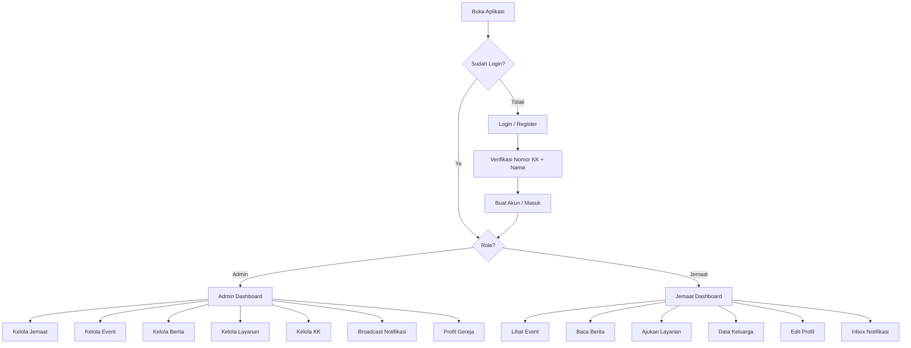
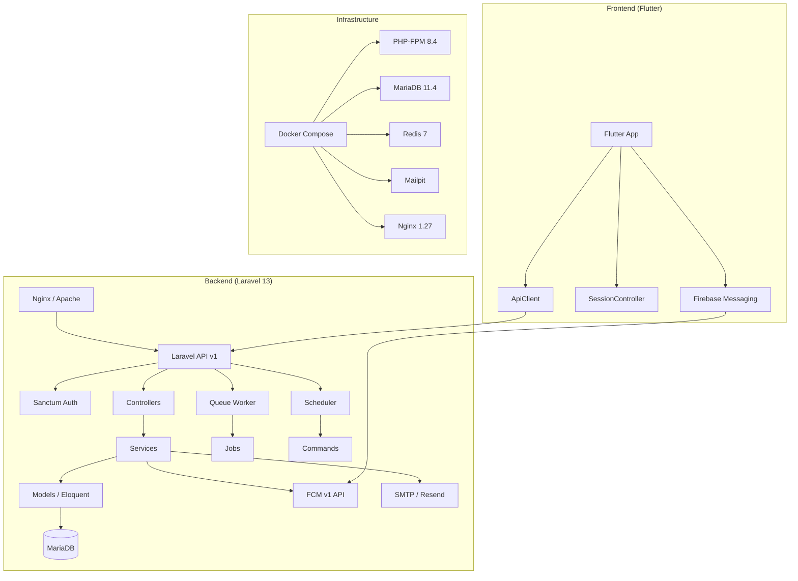

# 01 - Project Overview

## Tujuan Aplikasi

Aplikasi manajemen gereja (Church Management System) yang berfungsi sebagai platform digital untuk mengelola data jemaat, kegiatan gereja, berita, layanan gereja, dan notifikasi push. Dirancang sebagai solusi mobile-first menggunakan Flutter dengan backend Laravel REST API.

## Masalah yang Diselesaikan

1. **Pengelolaan data jemaat manual** → Digitalisasi data anggota gereja dan kartu keluarga (KK)
2. **Informasi kegiatan tersebar** → Sentralisasi event, berita, dan pengumuman gereja
3. **Pengajuan layanan birokrasi** → Digitalisasi proses pengajuan layanan gereja (baptis, nikah, dll)
4. **Komunikasi tidak efektif** → Push notification dan broadcast untuk seluruh jemaat
5. **Pencatatan KK manual** → Sistem registrasi dan verifikasi Kartu Keluarga digital

## User Flow

## Aktor

| Aktor      | Role     | Deskripsi                                                                                 |
| ---------- | -------- | ----------------------------------------------------------------------------------------- |
| **Admin**  | `admin`  | Pengelola gereja. Dapat CRUD jemaat, event, berita, layanan, KK, dan broadcast notifikasi |
| **Jemaat** | `jemaat` | Anggota gereja. Dapat melihat event/berita, mengajukan layanan, dan melihat data keluarga |

## Fitur Utama

### Authentication & Authorization

- Registrasi dengan verifikasi Nomor KK + Nama
- Login via username/email + password
- Token-based auth (Laravel Sanctum)
- Role-based access: `admin` dan `jemaat`

### Manajemen Jemaat (Admin)

- CRUD data jemaat
- Filter berdasarkan KK, status (active/jemaat/simpatisan)
- Data keluarga berdasarkan nomor KK

### Manajemen Event

- CRUD event gereja dengan kategori
- Upload dokumentasi event (file/foto)
- Download dokumentasi sebagai ZIP
- Auto-archive event yang expired
- Push reminder H-2 dan H-1

### Manajemen Berita

- CRUD berita dengan cover image
- Upload lampiran file
- Download lampiran sebagai ZIP
- Filter berdasarkan status published

### Layanan Gereja

- Template form dinamis per kategori layanan
- Pengajuan layanan oleh jemaat
- Tracking status: pending → approved/rejected
- Export aplikasi layanan ke CSV
- Generate sertifikat layanan (PDF)

### Registrasi Kartu Keluarga

- CRUD registrasi KK
- Verifikasi KK sebelum registrasi
- Relasi KK → anggota keluarga

### Notifikasi

- Push notification via FCM v1
- Email notification (fallback)
- Broadcast ke semua/role/users tertentu
- Inbox notifikasi personal
- Tracking read/unread

### Profil Gereja

- Kelola profil gereja (nama, alamat, logo, metadata)

## Arsitektur Tinggi

## Dependency Utama

### Backend (Laravel)

| Package                        | Fungsi                                 |
| ------------------------------ | -------------------------------------- |
| `laravel/framework` ^13.0      | Framework utama                        |
| `laravel/sanctum` ^4.3         | Token-based API authentication         |
| `barryvdh/laravel-dompdf` ^3.1 | PDF generation (sertifikat layanan)    |
| `google/auth` ^1.52            | Google OAuth untuk FCM service account |
| `predis/predis` ^3.4           | Redis client untuk cache dan queue     |
| `resend/resend-php` ^1.1       | Email delivery via Resend              |

### Frontend (Flutter)

| Package                               | Fungsi                                |
| ------------------------------------- | ------------------------------------- |
| `firebase_core` ^3.4.0                | Firebase initialization               |
| `firebase_messaging` ^15.2.10         | Push notifications                    |
| `flutter_local_notifications` ^17.1.2 | Local notification display            |
| `http` ^1.5.0                         | HTTP client untuk API                 |
| `shared_preferences` ^2.5.3           | Penyimpanan token lokal               |
| `cached_network_image` ^3.4.1         | Cache gambar jaringan                 |
| `image_picker` ^1.1.2                 | Ambil foto profil                     |
| `shimmer` ^3.0.0                      | Loading skeleton                      |
| `intl` ^0.20.2                        | Internationalization / format tanggal |
