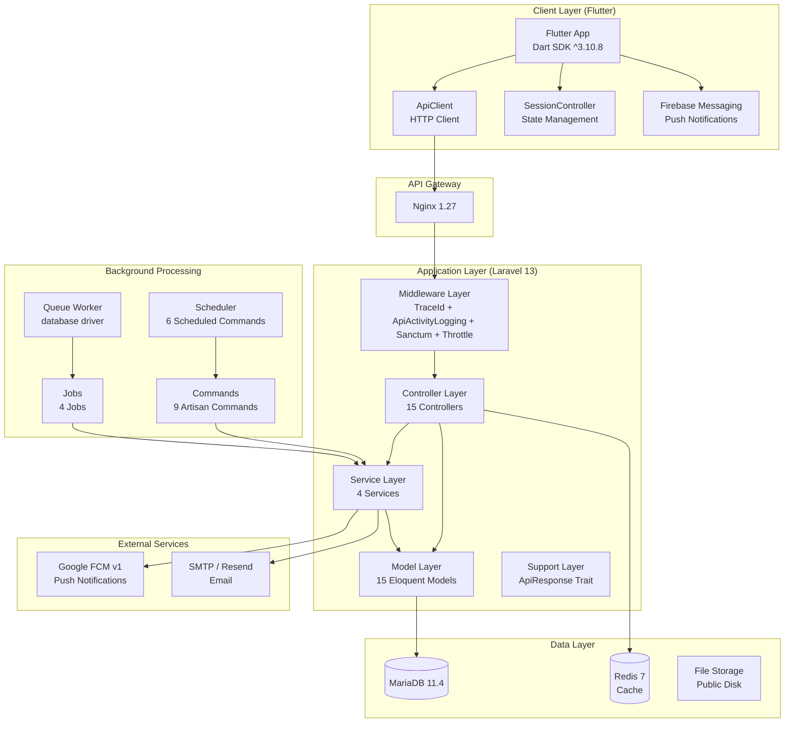
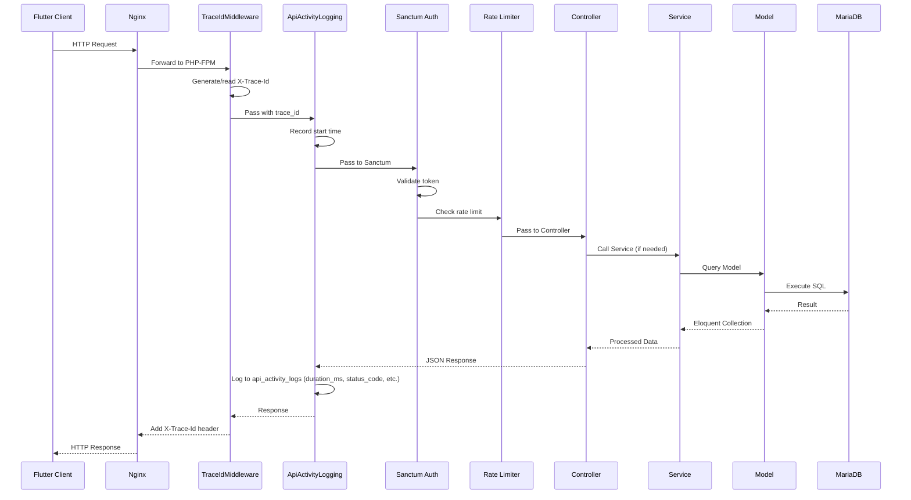
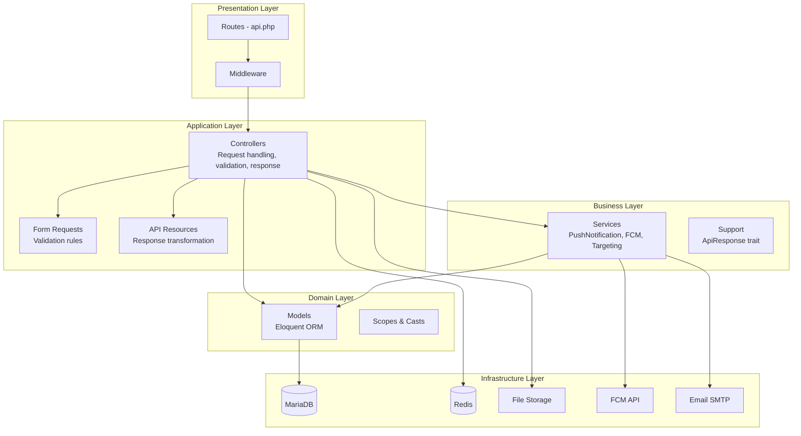
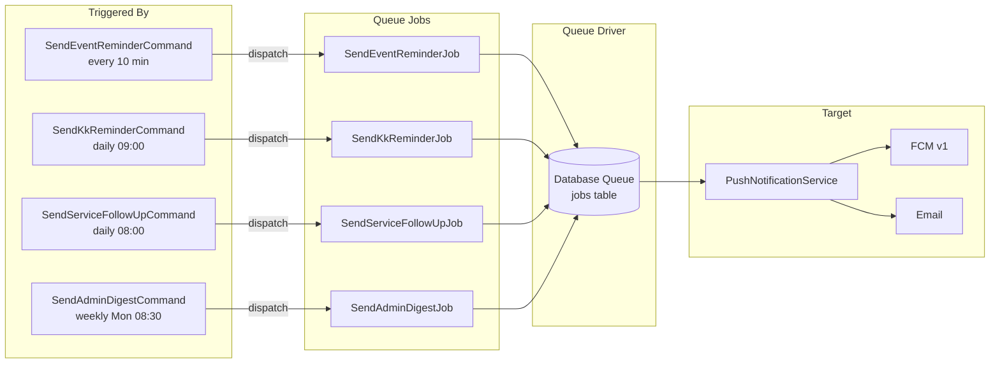

# 03 - Architecture

## Arsitektur Project

Aplikasi menggunakan arsitektur **Client-Server** dengan pemisahan jelas antara frontend (Flutter) dan backend (Laravel REST API).



## Alur Request



## Alur Response

Semua response API menggunakan format standar melalui `ApiResponse` trait:

### Success Response

```json
{
    "status": "success",
    "message": "Operasi berhasil",
    "data": { ... },
    "trace_id": "req-abc123"
}
```

### Error Response

```json
{
  "status": "error",
  "error_code": "VALIDATION_ERROR",
  "message": "Validasi gagal",
  "trace_id": "req-abc123",
  "errors": {
    "field_name": ["Error message 1"]
  }
}
```

### Paginated Response

```json
{
    "status": "success",
    "message": "...",
    "data": [...],
    "meta": {
        "current_page": 1,
        "per_page": 15,
        "total": 100,
        "last_page": 7,
        "has_more": true
    }
}
```

## Layer Architecture



## MVC Pattern

Project mengikuti pola **MVC + Service Layer**:

| Layer          | Komponen                                  | Tanggung Jawab                             |
| -------------- | ----------------------------------------- | ------------------------------------------ |
| **Model**      | 15 Eloquent Models                        | Representasi data, relasi, casting, scopes |
| **View**       | Flutter App (frontend), Blade views (PDF) | UI rendering                               |
| **Controller** | 15 Controllers                            | Handle HTTP request, validasi, response    |
| **Service**    | 4 Services                                | Business logic kompleks (notifikasi, FCM)  |
| **Support**    | ApiResponse Trait                         | Standarisasi format response               |

## Service Layer

| Service                        | Tanggung Jawab                                                                              |
| ------------------------------ | ------------------------------------------------------------------------------------------- |
| `PushNotificationService`      | Kirim push notification via FCM v1, email fallback, logging ke `notification_dispatch_logs` |
| `FcmAccessTokenProvider`       | Obtain OAuth2 access token dari Google service account, cache 55 menit                      |
| `FcmAuthService`               | Autentikasi FCM (legacy, wrapper)                                                           |
| `NotificationTargetingService` | Resolve target devices berdasarkan type (all/role/users/event_attendees/service_applicants) |

## Event Flow

Belum ditemukan pada source code. Project tidak menggunakan Laravel Events/Listeners. Notifikasi dikirim langsung melalui `PushNotificationService`.

## Broadcast Flow

Belum ditemukan pada source code. Project tidak menggunakan Laravel Broadcasting (WebSocket). Broadcast notifikasi dilakukan melalui REST API endpoint `POST /api/v1/notifications/broadcast`.

## Queue Flow



## Scheduler

| Command                       | Schedule         | Fungsi                            |
| ----------------------------- | ---------------- | --------------------------------- |
| `ArchiveExpiredEventsCommand` | Every 15 min     | Auto-archive event yang expired   |
| `SendEventReminderCommand`    | Every 10 min     | Kirim reminder push H-2           |
| `SendEventLastCallCommand`    | Every 10 min     | Kirim reminder push H-1           |
| `SendServiceFollowUpCommand`  | Daily 08:00      | Follow-up pengajuan layanan stale |
| `SendKkReminderCommand`       | Daily 09:00      | Reminder registrasi KK            |
| `SendAdminDigestCommand`      | Weekly Mon 08:30 | Kirim digest mingguan ke admin    |
