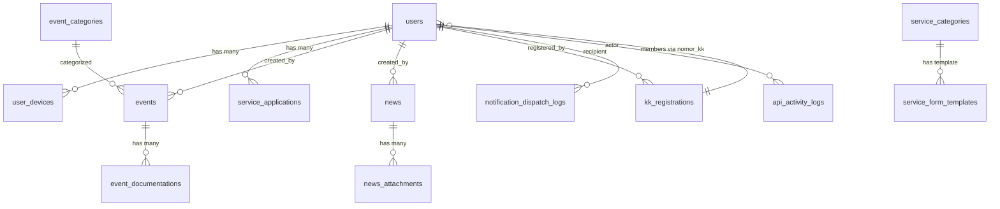

# 05 - Database

## Overview

- **Database**: MariaDB 11.4 (atau MySQL compatible)
- **Driver**: `pdo_mysql`
- **Character Set**: `utf8mb4` / `utf8mb4_unicode_ci`
- **Total Migrations**: 32 files
- **ORM**: Eloquent (Laravel)

## Entity Relationship Diagram



## Tabel Detail

### `users`

| Field              | Type            | Nullable | Default        | Deskripsi                                  |
| ------------------ | --------------- | -------- | -------------- | ------------------------------------------ |
| id                 | bigint unsigned | No       | auto_increment | Primary key                                |
| name               | varchar(255)    | No       | -              | Nama lengkap                               |
| username           | varchar(255)    | No       | unique         | Username login                             |
| email              | varchar(255)    | Yes      | unique         | Email (nullable sejak migrasi)             |
| password           | varchar(255)    | No       | -              | Password (bcrypt hashed)                   |
| role               | varchar(255)    | No       | 'jemaat'       | Role: `admin` / `jemaat`                   |
| nomor_kk           | varchar(255)    | Yes      | -              | Nomor Kartu Keluarga                       |
| jenis_kelamin      | varchar(255)    | Yes      | -              | `L` / `P`                                  |
| usia               | integer         | Yes      | -              | Umur                                       |
| alamat             | text            | Yes      | -              | Alamat                                     |
| phone_number       | varchar(20)     | Yes      | -              | Nomor telepon                              |
| status             | varchar(255)    | Yes      | 'active'       | Status: `active` / `jemaat` / `simpatisan` |
| profile_photo_path | varchar(255)    | Yes      | -              | Path foto profil di storage                |
| email_verified_at  | timestamp       | Yes      | -              | Tanggal verifikasi email                   |
| remember_token     | varchar(100)    | Yes      | -              | Remember token                             |
| created_at         | timestamp       | Yes      | -              | -                                          |
| updated_at         | timestamp       | Yes      | -              | -                                          |

**Relasi**: HasMany → `user_devices`, `service_applications`. BelongsTo → `kk_registrations` (via nomor_kk).
**Index**: `email` (unique), `username` (unique)

---

### `kk_registrations`

| Field                | Type            | Nullable | Default        | Deskripsi               |
| -------------------- | --------------- | -------- | -------------- | ----------------------- |
| id                   | bigint unsigned | No       | auto_increment | Primary key             |
| nomor_kk             | varchar(32)     | No       | unique         | Nomor KK (min 16 char)  |
| nama_kepala_keluarga | varchar(160)    | No       | -              | Nama kepala keluarga    |
| alamat               | text            | Yes      | -              | Alamat                  |
| phone_number         | varchar(20)     | Yes      | -              | Telepon                 |
| registered_by        | bigint unsigned | Yes      | FK → users.id  | Admin yang mendaftarkan |
| created_at           | timestamp       | Yes      | -              | -                       |
| updated_at           | timestamp       | Yes      | -              | -                       |

**Tujuan**: Menyimpan data KK gereja. Digunakan untuk verifikasi registrasi user baru.
**Relasi**: HasMany → `users` (via nomor_kk). BelongsTo → `users` (registered_by).

---

### `events`

| Field       | Type            | Nullable | Default        | Deskripsi                             |
| ----------- | --------------- | -------- | -------------- | ------------------------------------- |
| id          | bigint unsigned | No       | auto_increment | Primary key                           |
| title       | varchar(255)    | No       | -              | Judul event                           |
| description | text            | Yes      | -              | Deskripsi                             |
| date        | datetime        | Yes      | -              | Tanggal event (legacy)                |
| start_at    | datetime        | Yes      | -              | Waktu mulai                           |
| end_at      | datetime        | Yes      | -              | Waktu selesai                         |
| location    | json            | Yes      | -              | Lokasi {address, latitude, longitude} |
| category    | varchar(255)    | Yes      | -              | Kode kategori event                   |
| is_archived | boolean         | No       | false          | Flag archive                          |
| archived_at | datetime        | Yes      | -              | Waktu di-archive                      |
| created_by  | bigint unsigned | Yes      | FK → users.id  | Admin pembuat                         |
| created_at  | timestamp       | Yes      | -              | -                                     |
| updated_at  | timestamp       | Yes      | -              | -                                     |

**Tujuan**: Menyimpan kegiatan/event gereja.
**Relasi**: HasMany → `event_documentations`. BelongsTo → `users` (created_by).
**Scope**: `visibleToMembers` — hanya event is_archived=false.

---

### `event_documentations`

| Field          | Type            | Nullable | Default        | Deskripsi            |
| -------------- | --------------- | -------- | -------------- | -------------------- |
| id             | bigint unsigned | No       | auto_increment | Primary key          |
| event_id       | bigint unsigned | No       | FK → events.id | Event terkait        |
| file_path      | varchar(255)    | No       | -              | Path file di storage |
| mime_type      | varchar(255)    | Yes      | -              | MIME type file       |
| file_size      | integer         | Yes      | -              | Ukuran file (bytes)  |
| report_summary | text            | Yes      | -              | Ringkasan laporan    |
| created_at     | timestamp       | Yes      | -              | -                    |
| updated_at     | timestamp       | Yes      | -              | -                    |

**Tujuan**: Menyimpan file dokumentasi event (foto, video, dokumen).

---

### `event_categories`

| Field      | Type            | Nullable | Default        | Deskripsi     |
| ---------- | --------------- | -------- | -------------- | ------------- |
| id         | bigint unsigned | No       | auto_increment | Primary key   |
| code       | varchar(80)     | No       | unique         | Kode kategori |
| name       | varchar(255)    | No       | -              | Nama kategori |
| is_active  | boolean         | No       | true           | Status aktif  |
| sort_order | integer         | No       | 0              | Urutan tampil |
| created_at | timestamp       | Yes      | -              | -             |
| updated_at | timestamp       | Yes      | -              | -             |

---

### `news`

| Field        | Type            | Nullable | Default        | Deskripsi        |
| ------------ | --------------- | -------- | -------------- | ---------------- |
| id           | bigint unsigned | No       | auto_increment | Primary key      |
| title        | varchar(255)    | No       | -              | Judul berita     |
| description  | text            | Yes      | -              | Ringkasan berita |
| content      | longText        | No       | -              | Konten lengkap   |
| cover_image  | json            | Yes      | -              | Data cover image |
| created_by   | bigint unsigned | Yes      | FK → users.id  | Admin pembuat    |
| published_at | datetime        | Yes      | -              | Tanggal publish  |
| created_at   | timestamp       | Yes      | -              | -                |
| updated_at   | timestamp       | Yes      | -              | -                |

**Relasi**: HasMany → `news_attachments`. BelongsTo → `users` (created_by).

---

### `news_attachments`

| Field      | Type            | Nullable | Default        | Deskripsi            |
| ---------- | --------------- | -------- | -------------- | -------------------- |
| id         | bigint unsigned | No       | auto_increment | Primary key          |
| news_id    | bigint unsigned | No       | FK → news.id   | Berita terkait       |
| file_path  | varchar(255)    | No       | -              | Path file di storage |
| file_name  | varchar(255)    | No       | -              | Nama file asli       |
| mime_type  | varchar(255)    | Yes      | -              | MIME type            |
| file_size  | integer         | Yes      | -              | Ukuran file (bytes)  |
| created_at | timestamp       | Yes      | -              | -                    |
| updated_at | timestamp       | Yes      | -              | -                    |

---

### `service_applications`

| Field             | Type             | Nullable | Default        | Deskripsi                         |
| ----------------- | ---------------- | -------- | -------------- | --------------------------------- |
| id                | bigint unsigned  | No       | auto_increment | Primary key                       |
| user_id           | bigint unsigned  | No       | FK → users.id  | Jemaat pengaju                    |
| nomor_kk_snapshot | varchar(32)      | Yes      | -              | Snapshot nomor KK saat pengajuan  |
| category          | varchar(255)     | No       | -              | Kategori layanan                  |
| form_data         | json             | No       | -              | Data form dinamis                 |
| attachments       | text (encrypted) | Yes      | -              | Lampiran (encrypted:array)        |
| status            | varchar(255)     | No       | 'pending'      | Status: pending/approved/rejected |
| admin_note        | text             | Yes      | -              | Catatan admin                     |
| created_at        | timestamp        | Yes      | -              | -                                 |
| updated_at        | timestamp        | Yes      | -              | -                                 |

**Tujuan**: Menyimpan pengajuan layanan gereja oleh jemaat.
**Penting**: Field `attachments` menggunakan cast `encrypted:array` — data dienkripsi di database.

---

### `service_categories`

| Sama dengan `event_categories` | code, name, is_active, sort_order |

---

### `service_form_templates`

| Field      | Type            | Nullable | Default        | Deskripsi              |
| ---------- | --------------- | -------- | -------------- | ---------------------- |
| id         | bigint unsigned | No       | auto_increment | Primary key            |
| category   | varchar(255)    | No       | unique         | Kode kategori layanan  |
| name       | varchar(255)    | No       | -              | Nama template          |
| fields     | json            | No       | -              | Definisi field dinamis |
| is_active  | boolean         | No       | true           | Status aktif           |
| created_at | timestamp       | Yes      | -              | -                      |
| updated_at | timestamp       | Yes      | -              | -                      |

**Tujuan**: Mendefinisikan form template dinamis untuk setiap kategori layanan.
**Format `fields`**:

```json
[
  {
    "key": "nama_lengkap",
    "type": "string",
    "label": "Nama Lengkap",
    "required": true
  },
  {
    "key": "tanggal_baptis",
    "type": "date",
    "label": "Tanggal Baptis",
    "required": true
  },
  {
    "key": "jenis",
    "type": "select",
    "label": "Jenis",
    "required": true,
    "options": ["Dewasa", "Anak"]
  }
]
```

---

### `user_devices`

| Field       | Type            | Nullable | Default        | Deskripsi                      |
| ----------- | --------------- | -------- | -------------- | ------------------------------ |
| id          | bigint unsigned | No       | auto_increment | Primary key                    |
| user_id     | bigint unsigned | No       | FK → users.id  | User pemilik                   |
| fcm_token   | varchar(255)    | No       | unique         | Firebase Cloud Messaging token |
| device_name | varchar(120)    | Yes      | -              | Nama device                    |
| device_type | varchar(255)    | No       | 'web'          | Tipe: web/android/ios          |
| last_active | datetime        | Yes      | -              | Terakhir aktif                 |
| created_at  | timestamp       | Yes      | -              | -                              |
| updated_at  | timestamp       | Yes      | -              | -                              |

---

### `notification_dispatch_logs`

| Field             | Type            | Nullable | Default        | Deskripsi                                                        |
| ----------------- | --------------- | -------- | -------------- | ---------------------------------------------------------------- |
| id                | bigint unsigned | No       | auto_increment | Primary key                                                      |
| sender_user_id    | bigint unsigned | Yes      | -              | Pengirim                                                         |
| recipient_user_id | bigint unsigned | Yes      | -              | Penerima                                                         |
| fcm_token         | varchar(255)    | Yes      | -              | Token FCM / email (untuk email provider)                         |
| module            | varchar(255)    | No       | -              | Modul (broadcast, service_application, dll)                      |
| event_type        | varchar(255)    | No       | -              | Tipe event (admin_broadcast, service_application_submitted, dll) |
| title             | varchar(255)    | No       | -              | Judul notifikasi                                                 |
| message           | text            | No       | -              | Isi notifikasi                                                   |
| context           | json            | Yes      | -              | Data konteks tambahan                                            |
| status            | varchar(255)    | No       | -              | Status: sent/failed/queued                                       |
| provider          | varchar(255)    | Yes      | -              | Provider: fcm_v1/fcm/email                                       |
| trace_id          | varchar(255)    | Yes      | -              | Trace ID request                                                 |
| provider_response | json            | Yes      | -              | Response dari provider                                           |
| read_at           | datetime        | Yes      | -              | Waktu dibaca                                                     |
| created_at        | timestamp       | Yes      | -              | -                                                                |
| updated_at        | timestamp       | Yes      | -              | -                                                                |

**Tujuan**: Log seluruh dispatch notifikasi. Berfungsi juga sebagai inbox notifikasi user.

---

### `api_activity_logs`

| Field         | Type            | Nullable | Default        | Deskripsi                   |
| ------------- | --------------- | -------- | -------------- | --------------------------- |
| id            | bigint unsigned | No       | auto_increment | Primary key                 |
| trace_id      | varchar(255)    | Yes      | -              | Trace ID                    |
| method        | varchar(10)     | No       | -              | HTTP method                 |
| path          | varchar(255)    | No       | -              | URL path                    |
| route_name    | varchar(255)    | Yes      | -              | Named route                 |
| query_params  | json            | Yes      | -              | Query parameters            |
| request_body  | json            | Yes      | -              | Request body (sanitized)    |
| response_body | json            | Yes      | -              | Response body (summarized)  |
| status_code   | integer         | No       | -              | HTTP status code            |
| duration_ms   | integer         | No       | -              | Durasi request (ms)         |
| ip_address    | varchar(45)     | Yes      | -              | IP address client           |
| user_agent    | varchar(255)    | Yes      | -              | User agent                  |
| user_id       | bigint unsigned | Yes      | -              | User yang melakukan request |
| created_at    | timestamp       | Yes      | -              | -                           |
| updated_at    | timestamp       | Yes      | -              | -                           |

---

### `church_profiles`

| Field      | Type            | Nullable | Default        | Deskripsi         |
| ---------- | --------------- | -------- | -------------- | ----------------- |
| id         | bigint unsigned | No       | auto_increment | Primary key       |
| name       | varchar(255)    | No       | -              | Nama gereja       |
| address    | text            | Yes      | -              | Alamat            |
| phone      | varchar(20)     | Yes      | -              | Telepon           |
| email      | varchar(255)    | Yes      | -              | Email             |
| logo       | json            | Yes      | -              | Data logo         |
| metadata   | json            | Yes      | -              | Metadata tambahan |
| created_at | timestamp       | Yes      | -              | -                 |
| updated_at | timestamp       | Yes      | -              | -                 |

---

### System Tables (Laravel)

| Table                    | Tujuan                |
| ------------------------ | --------------------- |
| `personal_access_tokens` | Sanctum API tokens    |
| `cache`                  | Database cache store  |
| `cache_locks`            | Cache lock management |
| `jobs`                   | Queue jobs            |
| `job_batches`            | Batch jobs            |
| `failed_jobs`            | Failed queue jobs     |
| `sessions`               | User sessions         |
