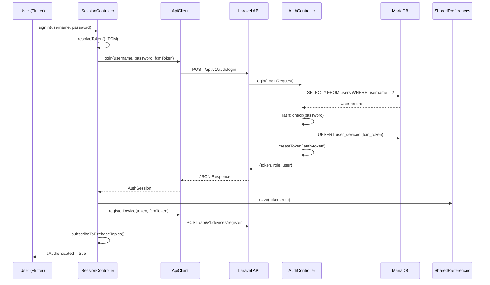
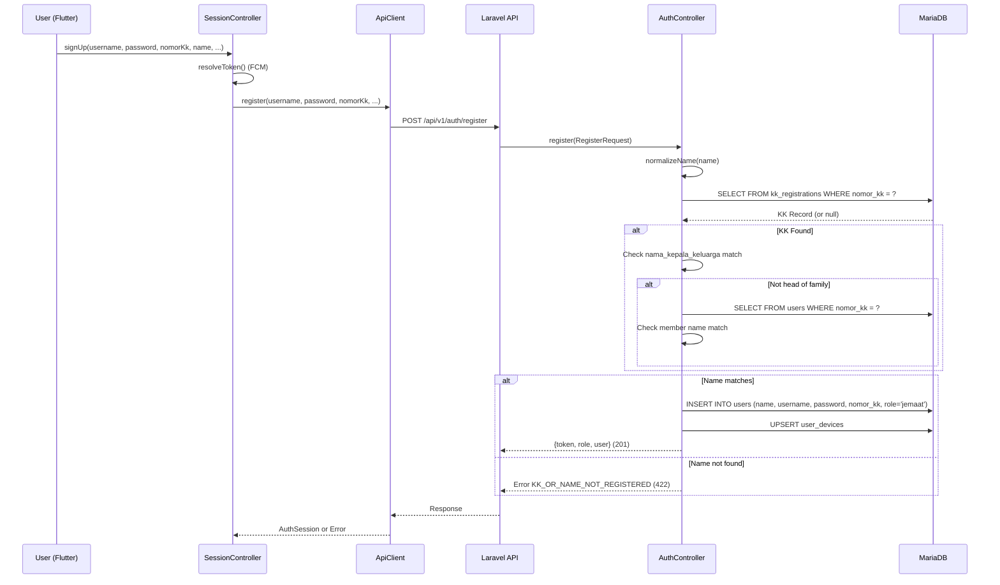
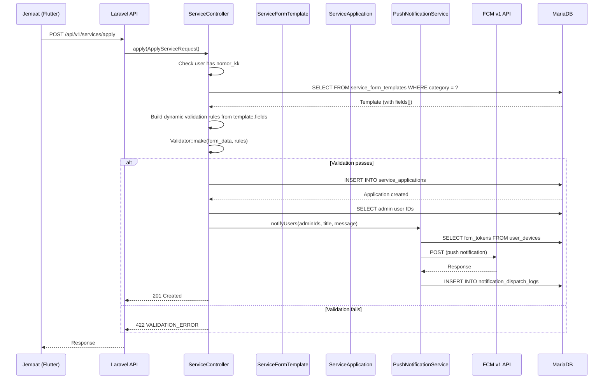
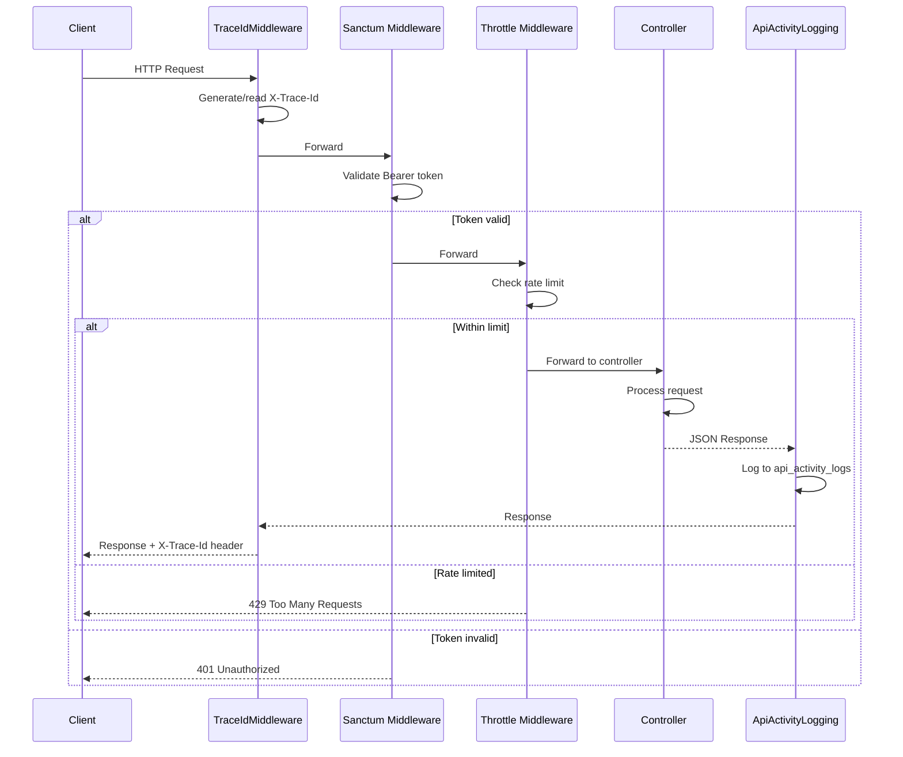
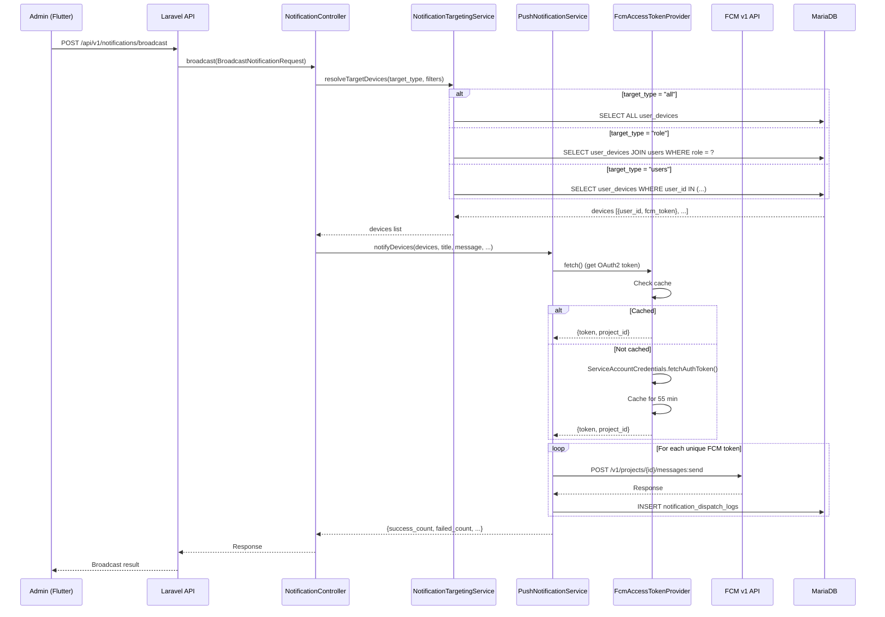
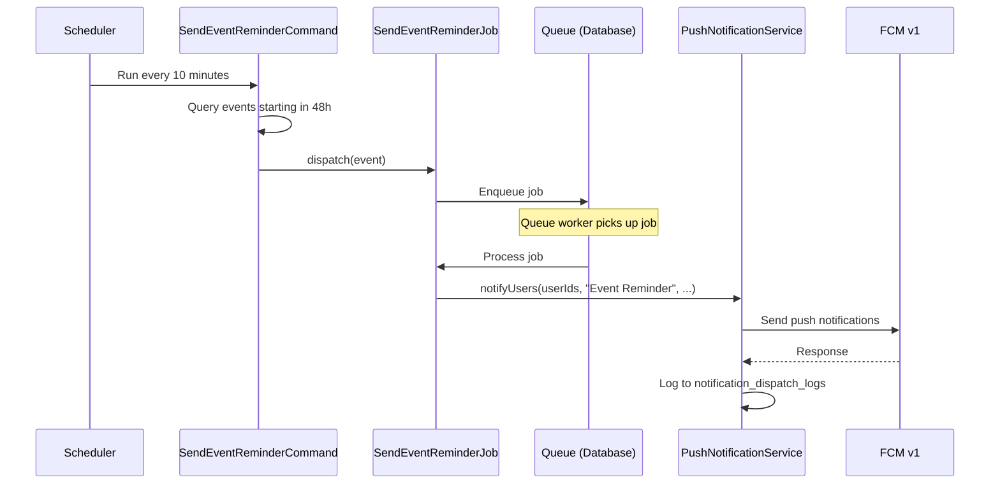

# 17 - Sequence Diagrams

## Login

```mermaid
sequenceDiagram
    participant U as User (Flutter)
    participant SC as SessionController
    participant AC as ApiClient
    participant API as Laravel API
    participant Auth as AuthController
    participant DB as MariaDB
    participant SP as SharedPreferences

    U->>SC: signIn(username, password)
    SC->>SC: resolveToken() (FCM)
    SC->>AC: login(username, password, fcmToken)
    AC->>API: POST /api/v1/auth/login
    API->>Auth: login(LoginRequest)
    Auth->>DB: SELECT * FROM users WHERE username = ?
    DB-->>Auth: User record
    Auth->>Auth: Hash::check(password)
    Auth->>DB: UPSERT user_devices (fcm_token)
    Auth->>Auth: createToken('auth-token')
    Auth-->>API: {token, role, user}
    API-->>AC: JSON Response
    AC-->>SC: AuthSession
    SC->>SP: save(token, role)
    SC->>AC: registerDevice(token, fcmToken)
    AC->>API: POST /api/v1/devices/register
    SC->>SC: subscribeToFirebaseTopics()
    SC-->>U: isAuthenticated = true
```

## Register

```mermaid
sequenceDiagram
    participant U as User (Flutter)
    participant SC as SessionController
    participant AC as ApiClient
    participant API as Laravel API
    participant Auth as AuthController
    participant DB as MariaDB

    U->>SC: signUp(username, password, nomorKk, name, ...)
    SC->>SC: resolveToken() (FCM)
    SC->>AC: register(username, password, nomorKk, ...)
    AC->>API: POST /api/v1/auth/register

    API->>Auth: register(RegisterRequest)
    Auth->>Auth: normalizeName(name)
    Auth->>DB: SELECT FROM kk_registrations WHERE nomor_kk = ?
    DB-->>Auth: KK Record (or null)

    alt KK Found
        Auth->>Auth: Check nama_kepala_keluarga match
        alt Not head of family
            Auth->>DB: SELECT FROM users WHERE nomor_kk = ?
            Auth->>Auth: Check member name match
        end
    end

    alt Name matches
        Auth->>DB: INSERT INTO users (name, username, password, nomor_kk, role='jemaat')
        Auth->>DB: UPSERT user_devices
        Auth-->>API: {token, role, user} (201)
    else Name not found
        Auth-->>API: Error KK_OR_NAME_NOT_REGISTERED (422)
    end

    API-->>AC: Response
    AC-->>SC: AuthSession or Error
```

## CRUD Utama — Service Application (Apply)

```mermaid
sequenceDiagram
    participant U as Jemaat (Flutter)
    participant API as Laravel API
    participant SC as ServiceController
    participant SFT as ServiceFormTemplate
    participant SA as ServiceApplication
    participant NS as PushNotificationService
    participant FCM as FCM v1 API
    participant DB as MariaDB

    U->>API: POST /api/v1/services/apply
    API->>SC: apply(ApplyServiceRequest)

    SC->>SC: Check user has nomor_kk
    SC->>DB: SELECT FROM service_form_templates WHERE category = ?
    DB-->>SC: Template (with fields[])

    SC->>SC: Build dynamic validation rules from template.fields
    SC->>SC: Validator::make(form_data, rules)

    alt Validation passes
        SC->>DB: INSERT INTO service_applications
        DB-->>SC: Application created

        SC->>DB: SELECT admin user IDs
        SC->>NS: notifyUsers(adminIds, title, message)
        NS->>DB: SELECT fcm_tokens FROM user_devices
        NS->>FCM: POST (push notification)
        FCM-->>NS: Response
        NS->>DB: INSERT INTO notification_dispatch_logs

        SC-->>API: 201 Created
    else Validation fails
        SC-->>API: 422 VALIDATION_ERROR
    end

    API-->>U: Response
```

## API Request — General Flow

```mermaid
sequenceDiagram
    participant C as Client
    participant TM as TraceIdMiddleware
    participant SM as Sanctum Middleware
    participant TH as Throttle Middleware
    participant CT as Controller
    participant AL as ApiActivityLogging

    C->>TM: HTTP Request
    TM->>TM: Generate/read X-Trace-Id
    TM->>SM: Forward
    SM->>SM: Validate Bearer token

    alt Token valid
        SM->>TH: Forward
        TH->>TH: Check rate limit

        alt Within limit
            TH->>CT: Forward to controller
            CT->>CT: Process request
            CT-->>AL: JSON Response
            AL->>AL: Log to api_activity_logs
            AL-->>TM: Response
            TM-->>C: Response + X-Trace-Id header
        else Rate limited
            TH-->>C: 429 Too Many Requests
        end
    else Token invalid
        SM-->>C: 401 Unauthorized
    end
```

## Broadcast Notification

```mermaid
sequenceDiagram
    participant A as Admin (Flutter)
    participant API as Laravel API
    participant NC as NotificationController
    participant TS as NotificationTargetingService
    participant PS as PushNotificationService
    participant FP as FcmAccessTokenProvider
    participant FCM as FCM v1 API
    participant DB as MariaDB

    A->>API: POST /api/v1/notifications/broadcast
    API->>NC: broadcast(BroadcastNotificationRequest)

    NC->>TS: resolveTargetDevices(target_type, filters)

    alt target_type = "all"
        TS->>DB: SELECT ALL user_devices
    else target_type = "role"
        TS->>DB: SELECT user_devices JOIN users WHERE role = ?
    else target_type = "users"
        TS->>DB: SELECT user_devices WHERE user_id IN (...)
    end

    DB-->>TS: devices [{user_id, fcm_token}, ...]
    TS-->>NC: devices list

    NC->>PS: notifyDevices(devices, title, message, ...)

    PS->>FP: fetch() (get OAuth2 token)
    FP->>FP: Check cache
    alt Cached
        FP-->>PS: {token, project_id}
    else Not cached
        FP->>FP: ServiceAccountCredentials.fetchAuthToken()
        FP->>FP: Cache for 55 min
        FP-->>PS: {token, project_id}
    end

    loop For each unique FCM token
        PS->>FCM: POST /v1/projects/{id}/messages:send
        FCM-->>PS: Response
        PS->>DB: INSERT notification_dispatch_logs
    end

    PS-->>NC: {success_count, failed_count, ...}
    NC-->>API: Response
    API-->>A: Broadcast result
```

## Queue — Event Reminder

```mermaid
sequenceDiagram
    participant S as Scheduler
    participant C as SendEventReminderCommand
    participant J as SendEventReminderJob
    participant Q as Queue (Database)
    participant PS as PushNotificationService
    participant FCM as FCM v1

    S->>C: Run every 10 minutes
    C->>C: Query events starting in 48h
    C->>J: dispatch(event)
    J->>Q: Enqueue job

    Note over Q: Queue worker picks up job

    Q->>J: Process job
    J->>PS: notifyUsers(userIds, "Event Reminder", ...)
    PS->>FCM: Send push notifications
    FCM-->>PS: Response
    PS->>PS: Log to notification_dispatch_logs
```
