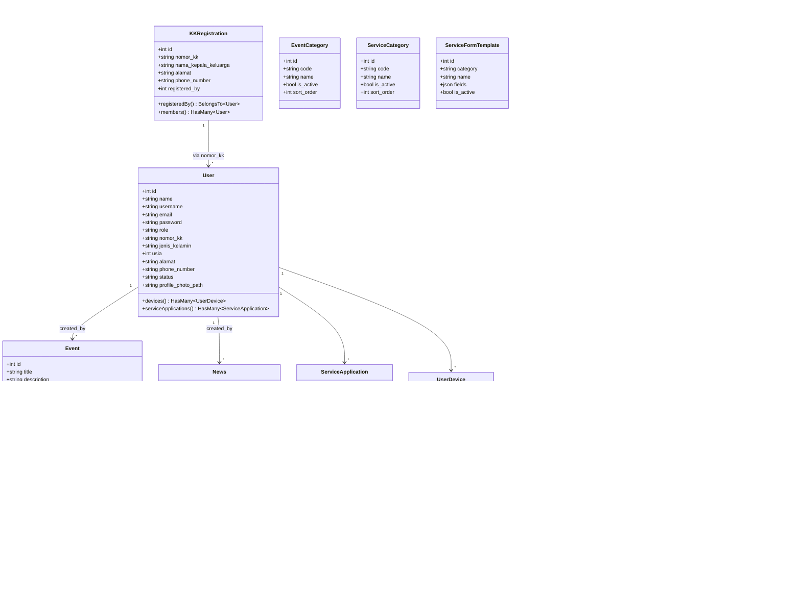
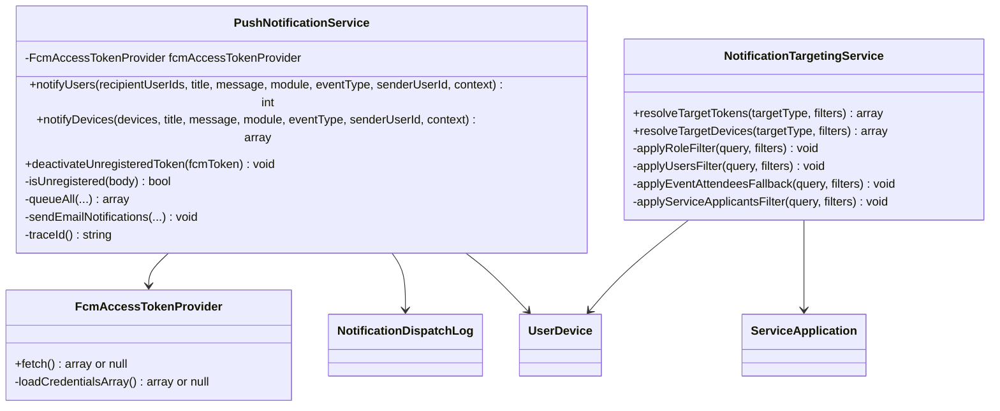
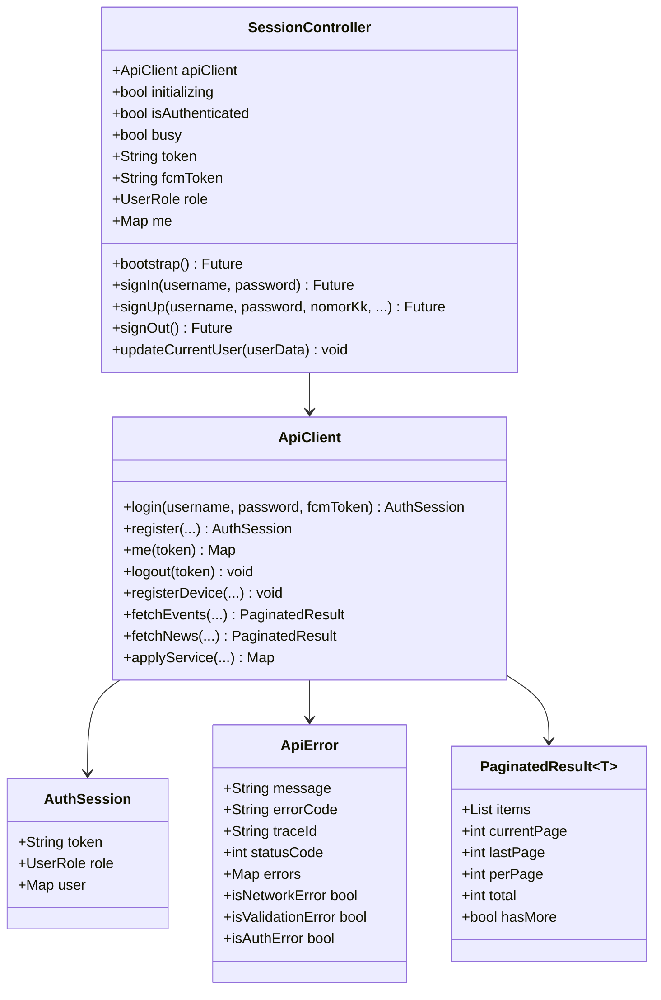

# 18 - Class Diagram

## Laravel Backend — Models & Relationships

```mermaid
classDiagram
    class User {
        +int id
        +string name
        +string username
        +string email
        +string password
        +string role
        +string nomor_kk
        +string jenis_kelamin
        +int usia
        +string alamat
        +string phone_number
        +string status
        +string profile_photo_path
        +devices() HasMany~UserDevice~
        +serviceApplications() HasMany~ServiceApplication~
    }

    class KKRegistration {
        +int id
        +string nomor_kk
        +string nama_kepala_keluarga
        +string alamat
        +string phone_number
        +int registered_by
        +registeredBy() BelongsTo~User~
        +members() HasMany~User~
    }

    class Event {
        +int id
        +string title
        +string description
        +datetime date
        +datetime start_at
        +datetime end_at
        +json location
        +string category
        +bool is_archived
        +datetime archived_at
        +int created_by
        +scopeVisibleToMembers()
        +isExpired() bool
        +creator() BelongsTo~User~
        +documentations() HasMany~EventDocumentation~
    }

    class EventDocumentation {
        +int id
        +int event_id
        +string file_path
        +string mime_type
        +int file_size
        +string report_summary
    }

    class EventCategory {
        +int id
        +string code
        +string name
        +bool is_active
        +int sort_order
    }

    class News {
        +int id
        +string title
        +string description
        +string content
        +json cover_image
        +int created_by
        +datetime published_at
        +creator() BelongsTo~User~
        +attachments() HasMany~NewsAttachment~
    }

    class NewsAttachment {
        +int id
        +int news_id
        +string file_path
        +string file_name
        +string mime_type
        +int file_size
    }

    class ServiceApplication {
        +int id
        +int user_id
        +string nomor_kk_snapshot
        +string category
        +json form_data
        +encrypted attachments
        +string status
        +string admin_note
        +user() BelongsTo~User~
    }

    class ServiceCategory {
        +int id
        +string code
        +string name
        +bool is_active
        +int sort_order
    }

    class ServiceFormTemplate {
        +int id
        +string category
        +string name
        +json fields
        +bool is_active
    }

    class UserDevice {
        +int id
        +int user_id
        +string fcm_token
        +string device_name
        +string device_type
        +datetime last_active
        +user() BelongsTo~User~
    }

    class NotificationDispatchLog {
        +int id
        +int sender_user_id
        +int recipient_user_id
        +string fcm_token
        +string module
        +string event_type
        +string title
        +string message
        +json context
        +string status
        +string provider
        +string trace_id
        +json provider_response
        +datetime read_at
    }

    class ChurchProfile {
        +int id
        +string name
        +string address
        +string phone
        +string email
        +json logo
        +json metadata
    }

    class ApiActivityLog {
        +int id
        +string trace_id
        +string method
        +string path
        +string route_name
        +json query_params
        +json request_body
        +json response_body
        +int status_code
        +int duration_ms
        +string ip_address
        +string user_agent
        +int user_id
    }

    User "1" --> "*" UserDevice
    User "1" --> "*" ServiceApplication
    User "1" --> "*" Event : created_by
    User "1" --> "*" News : created_by
    KKRegistration "1" --> "*" User : via nomor_kk
    Event "1" --> "*" EventDocumentation
    News "1" --> "*" NewsAttachment
```

## Laravel Backend — Services

```mermaid
classDiagram
    class PushNotificationService {
        -FcmAccessTokenProvider fcmAccessTokenProvider
        +notifyUsers(recipientUserIds, title, message, module, eventType, senderUserId, context) int
        +notifyDevices(devices, title, message, module, eventType, senderUserId, context) array
        +deactivateUnregisteredToken(fcmToken) void
        -isUnregistered(body) bool
        -queueAll(...) array
        -sendEmailNotifications(...) void
        -traceId() string
    }

    class FcmAccessTokenProvider {
        +fetch() array or null
        -loadCredentialsArray() array or null
    }

    class NotificationTargetingService {
        +resolveTargetTokens(targetType, filters) array
        +resolveTargetDevices(targetType, filters) array
        -applyRoleFilter(query, filters) void
        -applyUsersFilter(query, filters) void
        -applyEventAttendeesFallback(query, filters) void
        -applyServiceApplicantsFilter(query, filters) void
    }

    PushNotificationService --> FcmAccessTokenProvider
    PushNotificationService --> NotificationDispatchLog
    PushNotificationService --> UserDevice
    NotificationTargetingService --> UserDevice
    NotificationTargetingService --> ServiceApplication
```

## Flutter Frontend — Core Classes

```mermaid
classDiagram
    class SessionController {
        +ApiClient apiClient
        +bool initializing
        +bool isAuthenticated
        +bool busy
        +String token
        +String fcmToken
        +UserRole role
        +Map me
        +bootstrap() Future
        +signIn(username, password) Future
        +signUp(username, password, nomorKk, ...) Future
        +signOut() Future
        +updateCurrentUser(userData) void
    }

    class ApiClient {
        +login(username, password, fcmToken) AuthSession
        +register(...) AuthSession
        +me(token) Map
        +logout(token) void
        +registerDevice(...) void
        +fetchEvents(...) PaginatedResult
        +fetchNews(...) PaginatedResult
        +applyService(...) Map
    }

    class AuthSession {
        +String token
        +UserRole role
        +Map user
    }

    class ApiError {
        +String message
        +String errorCode
        +String traceId
        +int statusCode
        +Map errors
        +isNetworkError bool
        +isValidationError bool
        +isAuthError bool
    }

    class PaginatedResult~T~ {
        +List items
        +int currentPage
        +int lastPage
        +int perPage
        +int total
        +bool hasMore
    }

    SessionController --> ApiClient
    ApiClient --> AuthSession
    ApiClient --> ApiError
    ApiClient --> PaginatedResult
```
