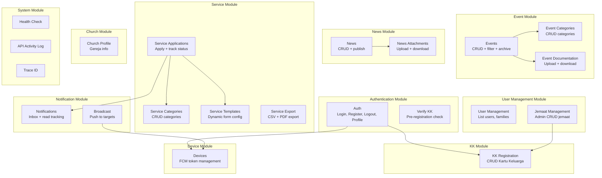

# 19 - Module Map

## Overview Module

## Keterkaitan Module Detail

### Authentication Module

- **Keterkaitan**: KK Module (verifikasi nomor KK saat register), Device Module (register FCM token saat login/register)
- **File**:
  - `AuthController.php` — Login, Register, Logout, Profile update, Photo upload
  - `VerifyKkController.php` — Pre-check KK sebelum form register

### User Management Module

- **Keterkaitan**: KK Module (query keluarga via nomor_kk)
- **File**:
  - `UserController.php` — List users (admin), families, family members (user)
  - `JemaatManagementController.php` — CRUD jemaat (admin)

### KK Module

- **Keterkaitan**: Auth Module (verifikasi), User Module (family lookup)
- **File**:
  - `KKRegistrationController.php` — CRUD KK
  - `KKRegistration.php` — Model dengan relasi members

### Event Module

- **Keterkaitan**: Notification Module (event reminders), Scheduler (auto-archive, reminders)
- **File**:
  - `EventController.php` — CRUD events + documentation
  - `EventCategoryController.php` — CRUD categories
  - `EventResource.php` — Response transformer
  - `ArchiveExpiredEventsCommand.php` — Auto archiving
  - `SendEventReminderCommand.php` — H-2 reminder
  - `SendEventLastCallCommand.php` — H-1 reminder

### News Module

- **Keterkaitan**: Standalone (tidak depend ke module lain)
- **File**:
  - `NewsController.php` — CRUD news + attachments
  - `NewsResource.php` — Response transformer

### Service Module

- **Keterkaitan**: Notification Module (notify admin on new application, notify user on status change), Auth Module (user profile check for nomor_kk)
- **File**:
  - `ServiceController.php` — Applications, templates, categories, status, certificate
  - `ServiceApplicationExportController.php` — CSV/PDF export
  - `SendServiceFollowUpCommand.php` — Follow-up stale applications

### Notification Module

- **Keterkaitan**: Device Module (FCM tokens), Service Module (trigger), Event Module (trigger)
- **File**:
  - `NotificationController.php` — Broadcast, inbox, read tracking
  - `PushNotificationService.php` — Core notification engine
  - `FcmAccessTokenProvider.php` — OAuth2 token management
  - `NotificationTargetingService.php` — Target device resolution
  - `SendAdminDigestCommand.php` — Weekly digest

### Device Module

- **Keterkaitan**: Auth Module (register on login), Notification Module (FCM tokens)
- **File**:
  - `DeviceController.php` — Register, refresh, revoke
  - `UserDevice.php` — Model

### Church Profile Module

- **Keterkaitan**: Standalone
- **File**:
  - `ChurchProfileController.php` — Show + upsert profile

### System Module

- **Keterkaitan**: Cross-cutting (semua module)
- **File**:
  - `HealthController.php` — API status check
  - `ApiActivityLoggingMiddleware.php` — Request/response logging
  - `TraceIdMiddleware.php` — Trace ID management
  - `ApiResponse.php` — Standardized response trait

## Flutter Pages ↔ API Mapping

| Flutter Page                    | API Endpoints Used                                                                                                                 |
| ------------------------------- | ---------------------------------------------------------------------------------------------------------------------------------- |
| `login_page.dart`               | POST /auth/login, POST /auth/register, POST /auth/verify-kk                                                                        |
| `jemaat_dashboard_page.dart`    | GET /events, GET /news, GET /notifications/unread-count, GET /church/profile                                                       |
| `jemaat_events_page.dart`       | GET /events, GET /events/categories                                                                                                |
| `jemaat_berita_page.dart`       | GET /news, GET /news/{id}, GET /news/{id}/attachments/download                                                                     |
| `jemaat_edit_profil_page.dart`  | GET /auth/me, PATCH /auth/me, POST /auth/me/photo                                                                                  |
| `admin_dashboard_page.dart`     | GET /events, GET /news, GET /services/applications, GET /users, GET /jemaats, GET /kk-registrations, POST /notifications/broadcast |
| `admin_jemaat_page.dart`        | GET /jemaats, DELETE /jemaats/{id}                                                                                                 |
| `admin_jemaat_form_page.dart`   | POST /jemaats, PUT /jemaats/{id}                                                                                                   |
| `admin_kk_management_page.dart` | GET /kk-registrations, POST /kk-registrations, PUT /kk-registrations/{id}, DELETE /kk-registrations/{id}                           |
| `admin_profile_page.dart`       | GET /auth/me, PATCH /auth/me, POST /auth/me/photo                                                                                  |
| `home_router_page.dart`         | — (routing only)                                                                                                                   |
